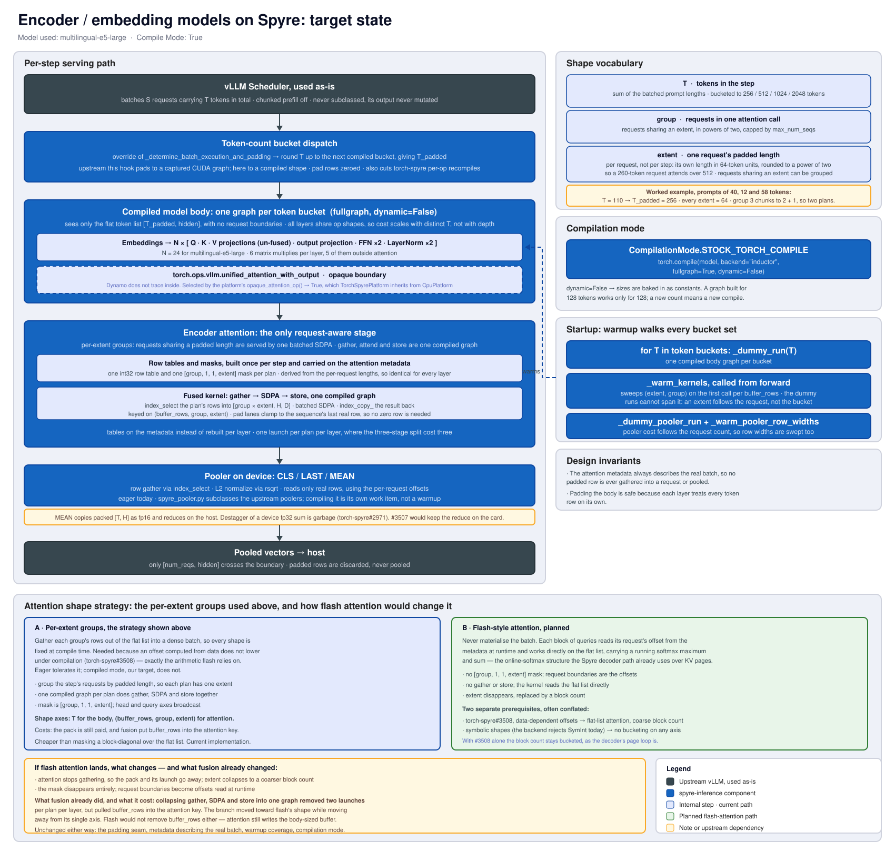

# Plugin Architecture

`spyre-inference` is a vLLM out-of-tree (OOT) platform plugin that enables inference on
IBM's Spyre AI accelerator. It integrates with vLLM's plugin system to replace key
compute layers with Spyre-optimized implementations while preserving the rest of the
vLLM execution pipeline.

## System Overview

The diagram below shows how `spyre-inference` fits into vLLM's process architecture.
Blue boxes are Spyre-specific classes provided by this plugin; dark boxes are vLLM base
classes; the gold box is the model loaded from vLLM's model registry with Spyre custom
ops injected via OOT registration.

<figure markdown="span">
  {: style="width: 140%; max-width: 1200px; margin-left: -20%;" }
  <figcaption>
    Process-level view of vLLM with the spyre-inference plugin. Dashed arrows (▷)
    indicate inheritance; solid arrows indicate composition or dependency.
  </figcaption>
</figure>

The plugin registers via two entry points:

| Entry Point | Target | Purpose |
|---|---|---|
| `vllm.platform_plugins` | `spyre_inference:register` | Registers `TorchSpyrePlatform` — sets dtype, worker class, attention backend, and distributed backend |
| `vllm.general_plugins` | `spyre_inference:register_ops` | Calls `register_all()` — importing the ops package triggers every `@register_oot()` layer swap, and `register_all()` additionally registers the `spyre_convert` and `spyre_vocab_mask` custom ops (RoPE registers no op — its rotation runs in-graph). Also overrides vLLM's `TransformersForCausalLM` with `SpyreTransformersForCausalLM` |

`vLLM` is built from source with `VLLM_TARGET_DEVICE=empty` (no device-specific C
kernels), so the platform overrides a few CPU-backend assumptions: `import_kernels()` is
a no-op (there is no `vllm._C`), and the model runner reimplements the slot-mapping
kernel in pure PyTorch.

## Component view of a Granite model

<figure markdown="span">
  {: style="width: 140%; max-width: 1000px; margin-left: -20%" }
  <figcaption>
    Static architecture of the spyre-inference plugin showing how it integrates with
    vLLM and which model layers are replaced for Spyre execution.
  </figcaption>
</figure>

## Custom Op Replacement

Each layer that requires Spyre-specific handling is replaced via vLLM's
`@ClassName.register_oot()` decorator. Most replacements are pure class swaps that run
when the ops package is imported. A couple also register a custom op via `register_all()`:
`spyre_convert` (the `convert` helper) keeps device transfers invisible to `torch.compile`,
and `spyre_vocab_mask` runs the vocab shard mask on CPU. RoPE registers no op — its
rotation-cache gather and 2×2 rotation run directly in the compiled graph (see below).

| vLLM Layer | Spyre Replacement | Device | Notes |
|---|---|---|---|
| `RMSNorm` | `SpyreRMSNorm` | Spyre | `forward_oot` runs a `maybe_compile`d kernel directly on Spyre; no float32 promotion (torch-spyre limitation) |
| `RotaryEmbedding`, `Llama3RotaryEmbedding` | `SpyreRotaryEmbedding`, `SpyreLlama3RotaryEmbedding` | Spyre | Fully on-device, no opaque op. A device-resident 4D rotation cache (`[max_pos, 2, 2, rotary_dim//2]`) is built from `cos_sin_cache` and **primed on-device in `_apply` before `torch.compile`**; `forward_oot` then gathers this pass's per-token slice with `index_select` and applies the 2×2 rotation-matrix formulation (`_rotate_neox_2x2`) — both traced directly into the full-model compile graph. Priming before compile is the requirement: building the cache lazily inside the traced forward segfaults libsenlib during warmup, whereas a cache already materialized on-device indexes cleanly. Only neox-style full rotary is supported — other configs raise `NotImplementedError` at construction. The 2×2 inner dim `rotary_dim//2` must also be stick-aligned; this is not re-checked but is guaranteed by head-dim padding (see below) |
| `VocabParallelEmbedding` | `SpyreVocabParallelEmbedding` | Spyre (mask on CPU when TP>1) | The weight moves to Spyre with the model and the embedding gather runs on-device (`aten.embedding` now has a Spyre kernel, torch-spyre#420). TP=1 gathers directly. When TP>1, only the shard mask runs on CPU via the `spyre_vocab_mask` op (Spyre inductor rejects the upstream int64-vs-Python-int comparisons); `masked_input`/`keep` are `convert`ed back to Spyre before the gather and `all_reduce` |
| `ColumnParallelLinear`, `MergedColumnParallelLinear`, `QKVParallelLinear`, `RowParallelLinear`, `ReplicatedLinear` | `SpyreColumnParallelLinear`, `SpyreMergedColumnParallelLinear`, `SpyreQKVParallelLinear`, `SpyreRowParallelLinear`, `SpyreReplicatedLinear` | Spyre | All five swap in `SpyreUnquantizedLinearMethod` (the transposed-weight fast path below). `SpyreQKVParallelLinear` additionally asserts `gather_output=False`; `SpyreRowParallelLinear` (`o_proj`, `down_proj`) inherits upstream's `all_reduce` when `reduce_results=True` under TP>1 |
| `SiluAndMul` | `SpyreSiluAndMul` | Spyre | `forward_oot` runs a `torch.compile`d `forward_native` directly on the fused `[..., 2*d]` tensor; the gate/up slice stays on Spyre (indirect access, no CPU detour) |
| `ParallelLMHead` | `SpyreParallelLMHead` | Spyre | TP≥1 with vocab sharding; per-rank weight padded to a multiple of 64×32 and pre-transposed; `apply` runs `x @ Wᵀ` then the un-pad slice, on Spyre — eager, no CPU detour; logits stay on Spyre for the TP `all_gather` |
| `LogitsProcessor` | `SpyreLogitsProcessor` | — | Makes logits contiguous — the downstream in-place `logits *= scale` otherwise trips a torch-spyre compile issue |

### Transposed linear weights

`F.linear(x, W)` computes `x @ Wᵀ` however `W` is laid out, and on Spyre that transposed
matmul is ~3.5× slower than a plain `x @ A`
([torch-spyre#3512](https://github.com/torch-spyre/torch-spyre/issues/3512)).
`SpyreTransposedWeightMethod` (`custom_ops/linear.py`) is the shared base that closes that gap
in two overrides:

- `process_weights_after_loading` replaces the loaded `[out, in]` weight with a contiguous
  `[in, out]` `Wᵀ` (optionally padding the output rows first), so the transpose is paid once at
  load time rather than every forward.
- `apply` runs `spyre_linear_t` — `torch.matmul(x, Wᵀ)` plus optional bias — instead of
  `F.linear`, dropping any trailing pad columns with an eager on-device un-pad slice.

`SpyreUnquantizedLinearMethod` uses the base defaults (transpose in place, no padding); the five
linear subclasses install it in `__init__`, but only when `quant_method` is an
`UnquantizedLinearMethod`; quantized layers keep their own method and the slower
`F.linear` path. This is the pure-PyTorch equivalent of torch-spyre's `[1,0]` weight
layout, which only fires for `nn.Linear` and so misses every vLLM parallel-linear.
`SpyreUnquantizedLMHeadMethod` reuses the same base with `WEIGHT_T_ATTR="padded_weight_t"` and
`ROW_ALIGN=64*32`, so the fast path and the padding/un-pad logic are defined once.

Fused projections stay fused. `SpyreQKVParallelLinear` returns the whole `[..., q+k+v]`
tensor and the unmodified upstream idiom `q, k, v = qkv.split(...)` slices it, exactly as
`SpyreMergedColumnParallelLinear`'s `[..., 2*d]` output feeds `SpyreSiluAndMul`, which
slices gate/up on-device. Earlier revisions instead split the QKV weight on CPU at load
time into three per-part GEMMs — a `SplitQKV` container built by an `analyze_and_unfuse`
pass — so that no fused output ever had to be sliced; one fused GEMM is faster than three,
so that pass is gone. The remaining slicing constraint is narrower than it was and lives
in the attention backend, where offset > 0 views still corrupt on transfer (see
[Attention Backend](#attention-backend)).

## Compilation Granularity

Under `CompilationMode.STOCK_TORCH_COMPILE`, `_compile_for_spyre` compiles each entry of
the model's block `ModuleList` in place via `block.compile(backend="inductor",
fullgraph=True, dynamic=False)`. In place matters: rebinding the list entry to the
`OptimizedModule` that `torch.compile` returns would re-parent the block under an
`_orig_mod` child and rename every parameter, breaking weight save/reload.

Blocks are found structurally — a `ModuleList` whose non-`PPMissingLayer` entries own an
`Attention` somewhere, and are not themselves `Attention` layers — so decoder stacks
(`model.layers`) and encoder stacks (`bert.encoder.layer`) are both covered, as are
hybrid Mamba+attention stacks that mix layer classes in one list. A `ModuleList` of bare
`Attention` layers (Zamba2's shared `dpa_list`) is skipped: it is not a block stack.
Models whose attention is not a vLLM `Attention` — MLA (DeepSeek, Kimi), vision-tower
attention — match nothing and fall back to a whole-model graph.

Blocks of one class share one `forward` code object, so Dynamo traces the first and the
rest reuse that entry; whatever it re-traces hits the Inductor FX graph cache. The
backend compile count is independent of depth, but it is not 1: layer 0 specializes
separately because `residual is None` there, so a Llama-shaped stack yields two
artifacts, and stacks that vary per layer yield more — Gemma 3 alternates sliding-window
and full attention, giving four. A fresh `num_tokens` tier then costs one block recompile
rather than a whole-model one. Note that `num_tokens` is the block graph's *only* shape
dependence: kv-cache length and the `KV_LENGTH_ALIGNMENT` tiers live inside
`unified_attention_with_output`, which is opaque to this graph and compiles its own
kernels (see [Kineto profiling](../user_guide/kineto_profiling.md)).

Depth independence relies on vLLM hoisting the per-layer attention name out of the graph,
which needs torch >= 2.11 and `VLLM_USE_LAYERNAME=1`. Without it each block bakes in its
own layer name and compiles separately, which is worse than the whole-model graph; the
runner logs a warning when it detects this. Inductor freezing (enabled by `max_autotune`)
defeats sharing the same way, by folding each block's weights into its own graph.

Embeddings and the final norm sit outside the block list and stay eager. `lm_head` was
never in the compiled region; `compute_logits` is a separate call on the wrapper.

`SPYRE_COMPILE_GRANULARITY=model` restores the whole-model fullgraph, whose compile cost
grows with layer count.

## Attention Backend

The `SpyreAttentionBackend` implements paged attention using pure PyTorch operations
(no custom CUDA kernels). The KV cache is one dense tensor per layer on Spyre,
`[num_blocks, block_size, num_kv_heads, head_size]` — the shape
`SpyreAttentionBackend.get_kv_cache_shape` advertises. It runs a FlashAttention-style
online softmax that iterates over pages without any compact-gather step, reading each
page by indexing the dense tensor with a one-element int32 device tensor (an indirect
access, so the compiled bundle carries a real index rather than a constant slice) and
permuting the token-major page to head-major on device before the matmuls. The cache is
allocated with the slot axis outermost in the device layout (`slot_major_kv_layout`) so
the write can scatter through a slot-major view of it:

| Step | Device | Operation |
|---|---|---|
| 1. q → CPU | CPU | Bring `q` to CPU when its layout cannot be assembled on device; `k`/`v` stay put |
| 2. Reshape & cache | Spyre | Scatter new K/V into the cache through a slot-major view: a token's destination is one index, so it is a single `index_copy_` per tensor |
| 3. Per-sequence varlen loop | CPU | Iterate sequences via `query_start_loc`, pad `query_len` to 32 |
| 4. Online softmax over pages | Spyre | Compiled per `(num_blocks, padded_query_len)` kernel: `Q @ Kᵀ · scale` → optional soft-cap → `+ tile_mask` → online softmax → `@ V` |
| 5. Write-back | CPU → Spyre | Stage each sequence's result into a CPU buffer, then one bulk copy into the Spyre output (per-token `spyre.overwrite` scatter doesn't scale) |

Key constraints:

- **KV length alignment**: 256 tokens (avoids per-step recompilation on Spyre)
- **Query chunk size**: 32 tokens (consistent tensor shapes for compilation)
- **Head size**: Must be a multiple of 64 (128-byte Spyre stick ÷ 2-byte float16)
- **Block size**: Must be a multiple of 64; the platform rounds a user-supplied
  `block_size` up to the next multiple of 64 automatically
- **GQA only**: MHA (`num_queries_per_kv = 1`) currently fails in the Spyre compiler's
  layout-propagation pass; only GQA configurations are exercised today
- **Supported**: sliding-window masking and logits soft-capping are both handled;
  ALiBi slopes are not

### Encoder-only attention

Encoder-only (embedding) models take a separate path. For `ENCODER`/`ENCODER_ONLY`
layers, `TorchSpyrePlatform.get_attn_backend_cls` selects `SpyreEncoderAttentionBackend`
→ `SpyreEncoderAttentionImpl` (both subclass the decoder backend/impl in
`spyre_encoder_attn.py`). This path has **no KV cache** — attention is bidirectional over
the full sequence — so it skips the paged-cache machinery entirely and instead:

1. Assembles a dense, padded batch on CPU (per-sequence variable-length slice, transpose,
   and scatter of ragged Q/K/V into `[num_seqs, H, L, D]`, plus an additive attention
   mask). Both sequence length `L` and head dim `D` are padded to the
   `ENCODER_SEQ_ALIGNMENT = 64` stick so the on-device matmuls stay stick-aligned (this
   is what lets small-head-dim models like MiniLM's `head_size=32` compile).
2. Runs a single batched `F.scaled_dot_product_attention` on Spyre
   (`is_causal=False`, additive mask, `enable_gqa` when `num_kv_heads != num_heads`).
3. Scatters the unpadded results back to CPU, then writes them per token into the Spyre
   output buffer.

## Encoder / embedding models: target state

Everything above describes what is implemented today. The diagram below is a **target
state** — where the encoder path is heading once the compile-mode work lands, and not a
description of current behaviour.

The shape of that target: the model body compiled once per token bucket, attention
shape-managed separately behind the opaque custom-op boundary, and a warmup that walks
both shape ladders so nothing compiles on the first request.

<figure markdown="span">
  {: style="width: 140%; max-width: 1400px; margin-left: -20%" }
  <figcaption>
    Target architecture for encoder / embedding models under
    <code>STOCK_TORCH_COMPILE</code>. Two shape axes are bucketed independently: the
    token count <code>T</code> for the model body, and <code>(S, L)</code> for
    attention's dense grid — they are decoupled because attention builds its grid by
    gathering rows rather than by being handed a reshaped tensor. The foot of the
    diagram contrasts today's dense-grid strategy with the planned flash-style variant,
    which would collapse the second axis and converge on the upstream design.
  </figcaption>
</figure>

## Device Placement Strategy

`TorchSpyreModelRunner` inherits from vLLM's `GPUModelRunner` and treats Spyre as the
"GPU" in the `CpuGpuBuffer` pattern. Buffers are created via a `SpyreCpuGpuBuffer`
override:

- **Float dtypes**: `.cpu` on CPU (numpy staging for the scheduler), `.gpu` on Spyre as
  `float16`
- **Int / bool dtypes**: `.gpu` aliased to `.cpu` (Spyre doesn't natively support these)

`self.device` stays `cpu` so that scatter, indexing, and block-table ops run on CPU, but
float compute tensors land on Spyre via `self._spyre_device`. Because there is no
`vllm._C` under `VLLM_TARGET_DEVICE=empty`, the runner also swaps in a pure-PyTorch
`_compute_slot_mapping` implementation for the paged-cache slot mapping.

At load time, `load_model` moves every module except `Attention` scale buffers onto Spyre.
The weight transposes happen before that, in each layer's
`process_weights_after_loading`, while the weights are still on CPU.

`_SpyreModelWrapper` sits between the model runner and the model and converts at the
call boundary:

- **Input**: CPU `int32`/`int64` tensors → Spyre `int64` (for embedding lookup)
- **Output**: Spyre `float16` tensors → CPU (for logits indexing and sampling)
- **`compute_logits`**: moves the CPU-sliced `hidden_states[logits_indices]` back onto
  Spyre for the `SpyreParallelLMHead` matmul, which returns logits on Spyre

`SpyreVocabParallelEmbedding` inherits weight loading and shard arithmetic from upstream
and overrides `forward`. The weight moves to Spyre with the rest of the model, and the
embedding gather runs on-device now that `aten.embedding` has a Spyre kernel
([torch-spyre#420](https://github.com/torch-spyre/torch-spyre/issues/420)) — this
replaces the earlier silent D2H/H2D CPU fallback that copied the full `[vocab, hidden]`
weight on every decode step. The one remaining CPU round-trip is the TP shard mask: when
TP>1, `forward` runs the upstream `get_masked_input_and_mask` helper on CPU (it does
int64 comparisons against Python int constants, which the Spyre inductor backend
rejects), then `convert`s `masked_input`/`keep` back to Spyre before the on-device gather
and `all_reduce`.

Hidden states flow on Spyre between decoder layers, with CPU round-trips only for
operations that Spyre doesn't yet support natively (the per-sequence
attention varlen loop, logits indexing). RoPE's rotation-cache gather and the embedding
gather both run on-device now, so neither is among them.

## Transformers backend

When `model_impl="transformers"`, `register_ops` swaps vLLM's `TransformersForCausalLM`
for `SpyreTransformersForCausalLM` (`spyre_inference/transformers_backend.py`). vLLM's
stock Transformers backend still handles model creation, weight loading, attention
routing, the KV cache, and scheduling, and its fusers replace HF's linear/norm/GLU
modules with vLLM layers — which the OOT registrations above then pick up automatically.

The subclass covers what upstream leaves to HF's module code. There is no RoPE fuser, so
HF's `rotary_emb` survives and would derive cos/sin inside the forward from int64
`position_ids`, a cast torch-spyre cannot lower. It is replaced with a precomputed
`[max_model_len, 2, 2, head_dim/2]` rotation cache — built on the host and moved to the
device before compile, leaving only an `index_select` in the graph — plus a matmul-based
`apply_rotary_pos_emb`. Head padding is shared with the native path: the platform widens
`head_dim` and the weight passes in `head_pad.py` pad Q/K interleaved, so this backend
only has to rebuild the rotation cache at the pre-pad frequencies.

Because the fusers key on class names, the OOT registry also covers the fused norms
(`SpyreTPAwareRMSNorm`, `SpyreTPAwareGemmaRMSNorm`); otherwise they fall back to
`forward_native` and its fp32 promotion.

## Distributed (TP)

`TorchSpyrePlatform.get_device_communicator_cls` returns `SpyreCommunicator`, a
`DeviceCommunicatorBase` override in
`spyre_inference/distributed/spyre_communicator.py`. The installed `libspyre_comms.so`
now implements `barrier`, `broadcast`, `send`/`recv`, list-form `allgather`, `gather`,
and `allreduce`; only `reduce` remains a throw-stub, and torch-spyre's spyreccl
backend still stubs `_allgather_base` (so `dist.all_gather_into_tensor` doesn't work).

`SpyreCommunicator` therefore only overrides:

- **`all_gather`** — routes CPU tensors through the gloo half of the multi-backend
  `cpu:gloo,spyre:spyreccl` group, and uses native list-form `dist.all_gather` for Spyre
  tensors (the base class's `dist.all_gather_into_tensor` path is blocked by the
  `_allgather_base` stub).
- **`reduce_scatter`** — raises; it is not on the TP forward path.

`all_reduce` and `gather` are no longer overridden — they now work natively via
`libspyre_comms`. Each remaining fallback is
tagged `REPLACE-WITH-NATIVE`; the `tests/probes/test_spyre_comms_native_probes.py` xfail-strict
suite is the canonical signal: when a probe flips green, delete the corresponding
override.

The worker (`TorchSpyreWorker`) inherits directly from vLLM's `Worker` (gpu_worker), not
`CPUWorker` — Spyre needs none of the CPU-specific init (NUMA binding, host-RAM
profiling). Data parallelism (`data_parallel_size > 1`) is rejected in
`check_and_update_config`.
